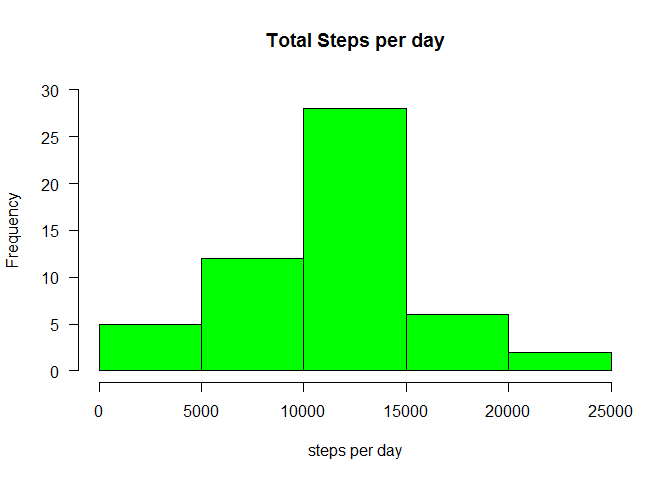
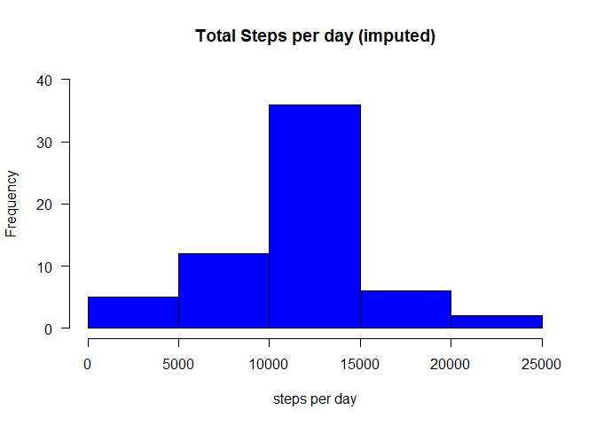
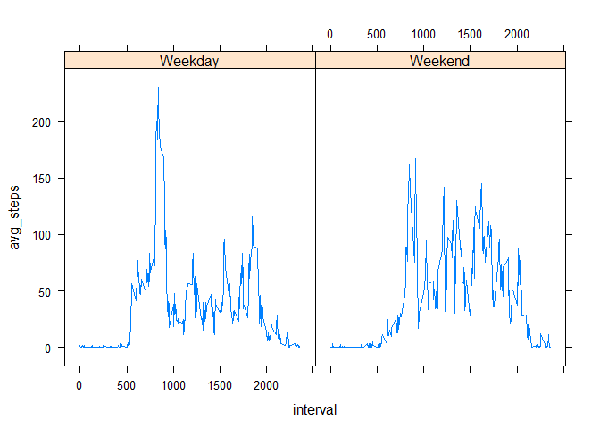

#Intro
We will be looking at data from a personal activity device. 
The raw data consists of a csv downloaded from here:
https://d396qusza40orc.cloudfront.net/repdata%2Fdata%2Factivity.zip

There are three variables:
steps - # of steps in a 5m interval. missing data is NA.
date - date on which measurement was taken.
interval - the 5 minute identifier for the day.

First we will read in the data and perform some rudimentary calculations on it.
We will be using the dplyr package for ease of aggregating and other functions.


```r
mydata <- read.csv("activity.csv")
library(dplyr)
```

```
## Warning: package 'dplyr' was built under R version 3.5.1
```

```
## 
## Attaching package: 'dplyr'
```

```
## The following objects are masked from 'package:stats':
## 
##     filter, lag
```

```
## The following objects are masked from 'package:base':
## 
##     intersect, setdiff, setequal, union
```

```r
str(mydata)
```

```
## 'data.frame':	17568 obs. of  3 variables:
##  $ steps   : int  NA NA NA NA NA NA NA NA NA NA ...
##  $ date    : Factor w/ 61 levels "2012-10-01","2012-10-02",..: 1 1 1 1 1 1 1 1 1 1 ...
##  $ interval: int  0 5 10 15 20 25 30 35 40 45 ...
```

Everything looks reasonable. We might want to look at changing the type for date field.


```r
mydata$date <- as.Date(mydata$date)
str(mydata)
```

```
## 'data.frame':	17568 obs. of  3 variables:
##  $ steps   : int  NA NA NA NA NA NA NA NA NA NA ...
##  $ date    : Date, format: "2012-10-01" "2012-10-01" ...
##  $ interval: int  0 5 10 15 20 25 30 35 40 45 ...
```
This will probably be better for us down the road, having the date column in "date" format as opposed to factor format.

# Calculating mean and median of number of steps taken per day

Here's a histogram of total steps per day so we have a visual depiction.


```
## Warning: package 'bindrcpp' was built under R version 3.5.1
```


```r
hist(mydata_grouped$tot_steps, main = "Total Steps per day", xlab = "steps per day", ylim = c(0,30), breaks = 6, col = "green", las=1)
```

<!-- -->


Here's a table of the steps per day along with the mean and median of total steps per day.


```r
mydata_grouped <- filter(mydata, !is.na(steps)) %>%
                  group_by(date) %>% 
                  summarize(tot_steps = sum(steps, na.rm = TRUE))
mydata_grouped <- cbind(mydata_grouped, 
                  mean_steps = mean(mydata_grouped$tot_steps,na.rm=TRUE),
                  median_steps = median(mydata_grouped$tot_steps,na.rm=TRUE))
mydata_grouped
```

```
##          date tot_steps mean_steps median_steps
## 1  2012-10-02       126   10766.19        10765
## 2  2012-10-03     11352   10766.19        10765
## 3  2012-10-04     12116   10766.19        10765
## 4  2012-10-05     13294   10766.19        10765
## 5  2012-10-06     15420   10766.19        10765
## 6  2012-10-07     11015   10766.19        10765
## 7  2012-10-09     12811   10766.19        10765
## 8  2012-10-10      9900   10766.19        10765
## 9  2012-10-11     10304   10766.19        10765
## 10 2012-10-12     17382   10766.19        10765
## 11 2012-10-13     12426   10766.19        10765
## 12 2012-10-14     15098   10766.19        10765
## 13 2012-10-15     10139   10766.19        10765
## 14 2012-10-16     15084   10766.19        10765
## 15 2012-10-17     13452   10766.19        10765
## 16 2012-10-18     10056   10766.19        10765
## 17 2012-10-19     11829   10766.19        10765
## 18 2012-10-20     10395   10766.19        10765
## 19 2012-10-21      8821   10766.19        10765
## 20 2012-10-22     13460   10766.19        10765
## 21 2012-10-23      8918   10766.19        10765
## 22 2012-10-24      8355   10766.19        10765
## 23 2012-10-25      2492   10766.19        10765
## 24 2012-10-26      6778   10766.19        10765
## 25 2012-10-27     10119   10766.19        10765
## 26 2012-10-28     11458   10766.19        10765
## 27 2012-10-29      5018   10766.19        10765
## 28 2012-10-30      9819   10766.19        10765
## 29 2012-10-31     15414   10766.19        10765
## 30 2012-11-02     10600   10766.19        10765
## 31 2012-11-03     10571   10766.19        10765
## 32 2012-11-05     10439   10766.19        10765
## 33 2012-11-06      8334   10766.19        10765
## 34 2012-11-07     12883   10766.19        10765
## 35 2012-11-08      3219   10766.19        10765
## 36 2012-11-11     12608   10766.19        10765
## 37 2012-11-12     10765   10766.19        10765
## 38 2012-11-13      7336   10766.19        10765
## 39 2012-11-15        41   10766.19        10765
## 40 2012-11-16      5441   10766.19        10765
## 41 2012-11-17     14339   10766.19        10765
## 42 2012-11-18     15110   10766.19        10765
## 43 2012-11-19      8841   10766.19        10765
## 44 2012-11-20      4472   10766.19        10765
## 45 2012-11-21     12787   10766.19        10765
## 46 2012-11-22     20427   10766.19        10765
## 47 2012-11-23     21194   10766.19        10765
## 48 2012-11-24     14478   10766.19        10765
## 49 2012-11-25     11834   10766.19        10765
## 50 2012-11-26     11162   10766.19        10765
## 51 2012-11-27     13646   10766.19        10765
## 52 2012-11-28     10183   10766.19        10765
## 53 2012-11-29      7047   10766.19        10765
```

#Daily activity pattern

We make a time series plot of the 5 minute interval, with average number of steps taken across all days.


```r
mydata_grouped <- filter(mydata, !is.na(steps)) %>%
                  group_by(interval) %>% 
                  summarize(avg_steps = mean(steps, na.rm = TRUE))
with(mydata_grouped,plot(interval, avg_steps,type="l"))
```

<!-- -->
We can find the 5 minute interval that contains the maximum number of steps in a number of different ways. Let's sort the data by size and just look at the top.


```r
head(arrange(mydata_grouped, desc(avg_steps)))
```

```
## # A tibble: 6 x 2
##   interval avg_steps
##      <int>     <dbl>
## 1      835      206.
## 2      840      196.
## 3      850      183.
## 4      845      180.
## 5      830      177.
## 6      820      171.
```

Thus we can see that the top interval is from 8:35:00 to 8:39:59 AM, with average of 206 steps.

# Part 4 - imputing missing values
How many of the rows in the original table are missing (NA?)


```r
dim(subset(mydata, is.na(mydata$steps)))
```

```
## [1] 2304    3
```

The return is a dataframe with dimensions 2304x3, which means 2,304 of the values are missing.
What probably makes the most sense to impute the missing values, just as a very rough and tumble solution is to use the average for the 5 minute interval as an imputed value. My process is going to be to separate out the NA values, apply the imputed values to those rows, reformat the data to make sure it's in the same format as before, and then recombine them. Then we will make a histogram.


```r
mydata_NA <- filter(mydata, is.na(steps))
mydata_NA <- merge(mydata_NA, mydata_grouped, by="interval")
mydata_NA <- select(mydata_NA,c(4,3,1))
mydata_NA <- rename(mydata_NA,steps = avg_steps)

mydata_imputed <- rbind(filter(mydata, !is.na(steps)), mydata_NA)

mydata_impgrouped <- group_by(mydata_imputed,date) %>% 
                  summarize(tot_steps = sum(steps, na.rm = TRUE))

hist(mydata_impgrouped$tot_steps, main = "Total Steps per day (imputed)", xlab = "steps per day", ylim = c(0,40), breaks = 6, col = "blue", las=1)
```

<!-- -->


Here's a table of the steps per day along with the mean and median of total steps per day.


```r
mydata_impgrouped <- cbind(mydata_impgrouped, 
                  mean_steps = mean(mydata_impgrouped$tot_steps,na.rm=TRUE),
                  median_steps = median(mydata_impgrouped$tot_steps,na.rm=TRUE))
head(mydata_impgrouped)
```

```
##         date tot_steps mean_steps median_steps
## 1 2012-10-01  10766.19   10766.19     10766.19
## 2 2012-10-02    126.00   10766.19     10766.19
## 3 2012-10-03  11352.00   10766.19     10766.19
## 4 2012-10-04  12116.00   10766.19     10766.19
## 5 2012-10-05  13294.00   10766.19     10766.19
## 6 2012-10-06  15420.00   10766.19     10766.19
```

As is logical with what we tried to do, the mean is now equal to the median since we put in so many new mean values. The histograms look similar except now there are more instances of the middle column, so many we had to adjust the y axis of the histogram.

#Looking at weekdays

We are going to add to our imputed dataset with weekday information and then investigate if step activity changes based on weekday vs. weekend.


```r
library(lattice)

mydata_imp_wday <- mutate(mydata_imputed, weekday = weekdays(date))
mydata_imp_wday <- mutate(mydata_imp_wday, weekend_ind = weekday %in% c("Sunday","Saturday"))
mydata_imp_wday <- mutate(mydata_imp_wday,weekend_id = ifelse(mydata_imp_wday$weekend_ind,"Weekend","Weekday"))

mydata_imp_wday_grouped <- group_by(mydata_imp_wday, interval, weekend_id) %>%
                           summarize(avg_steps = mean(steps))

xyplot(data=mydata_imp_wday_grouped, avg_steps~interval|weekend_id, type = "l")
```

<!-- -->
